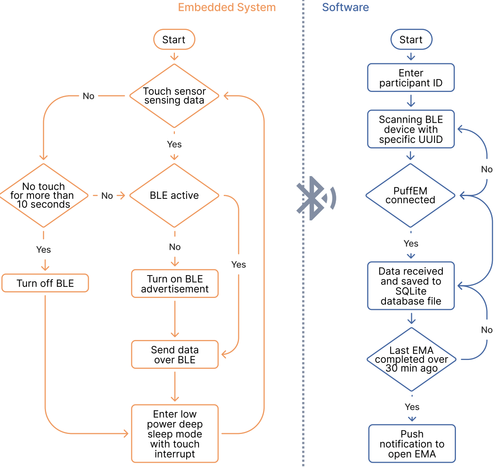

Understanding vaping behavior and nicotine intake is essential for addiction research and cessation support, but self-reports and gesture-based methods are unreliable and miss real-time events. **PuffEM** is a low-power, versatile e-cigarette sleeve that detects vaping events using a touch sensor and an on-the-surface magnetometer, and estimates the amount of vaporized nicotine. Paired with a mobile app, it captures sensor and contextual data to support behavioral research and health interventions.

**My role.** I co-led this project (equal first-authorship). We validated PuffEM in the lab across three ENDS devices and in a five-day in-the-wild deployment that demonstrated high usability and low burden. The work was published at **ACM/IEEE CHASE 2025**.
