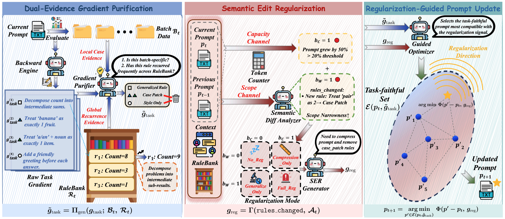

Large language models are highly sensitive to their prompts, and iterative prompt-optimization methods that rewrite prompts from model feedback tend to overfit: prompts grow longer, accumulate narrow sample-specific rules, and generalize poorly beyond the training distribution. We frame this failure mode as **prompt distributional overfitting** and measure it through *representational inefficiency*, which decomposes prompt inefficiency into capacity cost and scope narrowness.

**TextReg** is a regularization framework that realizes a soft-penalty objective through regularized textual gradients, combining three stages: Dual-Evidence Gradient Purification, Semantic Edit Regularization, and Regularization-Guided Prompt Update.

**My role.** I am a co-author on this collaboration. Across multiple reasoning benchmarks, TextReg substantially improves out-of-distribution generalization, with accuracy gains of up to +11.8% over TextGrad and +16.5% over REVOLVE.
